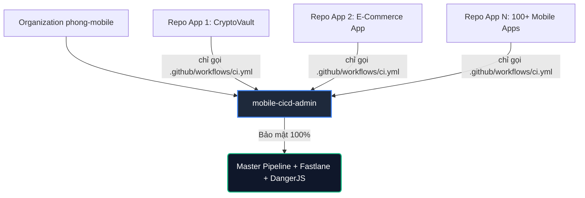

# 🔒 Centralized Mobile CI/CD & Governance Engine

[](https://github.com/phong-mobile)
[](.github/workflows/master-pipeline.yml)
[](configs/)
[](configs/Dangerfile.ts)
[](#)

> **Kho Quản Trị CI/CD Tập Trung Chuẩn Enterprise** dành riêng cho Organization Admins & Release Managers thuộc tổ chức **`phong-mobile`**.
> Toàn bộ logic nhạy cảm (Fastlane, ký số Keystore/Certificates, Dangerfile, Secrets, Rulesets) được cô lập tại đây. **Lập trình viên trên các repo ứng dụng (Consumer Repos) không thể xem, sửa đổi hay làm rò rỉ mã nguồn phát hành.**

---

## 📑 Mục lục
1. [Tại sao cần mô hình Centralized CI/CD?](#-tại-sao-cần-mô-hình-centralized-cicd)
2. [Cấu trúc Repository](#-cấu-trúc-repository)
3. [Chuẩn bị trước khi triển khai (Làm 1 lần duy nhất)](#-chuẩn-bị-trước-khi-triển-khai-làm-1-lần-duy-nhất)
4. [Hướng dẫn tích hợp vào một dự án mới](#-hướng-dẫn-tích-hợp-vào-một-dự-án-mới)
5. [Chi tiết các công cụ & Script cốt lõi](#-chi-tiết-các-công-cụ--script-cốt-lõi)
   - [`setup-github-rules.sh` — Tự động hoá Governance & Teams](#1-setup-github-rulessh--tự-động-hoá-governance--teams)
   - [`init-cicd.sh` — Interactive CLI & 70 Test Cases Health Check](#2-init-cicdsh--interactive-cli--70-test-cases-health-check)
   - [`configs/Dangerfile.ts` — Trọng tài Review Pull Request](#3-dangerfilets--trọng-tài-review-pr-tự-động)
   - [`src/featureFlags.js` — DJB2 Deterministic User Bucketing](#4-featureflagsjs--rollout-theo-tỷ-lệ--kill-switch)
6. [Các câu hỏi thường gặp (FAQ)](#-các-câu-hỏi-thường-gặp-faq)

---

## 🌟 Tại sao cần mô hình Centralized CI/CD?

Trong các mô hình truyền thống, mỗi dự án mobile tự quản lý file `.github/workflows/`, `Fastfile`, script ký số và tokens. Điều này dẫn đến các rủi ro:
* **Lộ lọt thông tin**: Developers có thể vô tình xem hoặc để lộ Keystore, API Keys, Certificate password.
* **Phân mảnh (Config Drift)**: 20 repo thì có 20 phiên bản CI/CD khác nhau, khi Apple/Google cập nhật policy bắt buộc thì phải sửa 20 nơi.
* **Khó kiểm soát chất lượng**: Không thể bắt buộc 100% repo tuân thủ Test coverage, Gitleaks scan hay chuẩn PR nếu không có quyền admin can thiệp.

### Giải pháp của `mobile-cicd-admin`:


1. **Zero-Touch Updates**: Admin sửa logic 1 chỗ ➔ 100+ dự án tự động cập nhật ngay lập tức.
2. **Hidden 100%**: Developers không có quyền truy cập repo admin ➔ Không thể thấy hoặc can thiệp vào quy trình release.
3. **Role-Based Governance (RBAC)**: Tự động phân quyền theo Team (`Developers`, `Tech Leads`, `Release Managers`), không bao giờ phải cấp quyền cho từng cá nhân.

---

## 📂 Cấu trúc Repository

```text
mobile-cicd-admin/
├── README.md                           # 📖 Tài liệu hướng dẫn kiến trúc & vận hành
├── setup-github-rules.sh               # 🔒 Script tạo Teams, Dual Approval Environments & Rulesets
├── init-cicd.sh                        # 🚀 CLI tương tác, chẩn đoán 70 Test Cases & theo dõi live log
├── setup.sh                            # 🛠️ Script scaffold/template cho các dự án cần config nội bộ
│
├── .github/
│   ├── actions/
│   │   └── notify/action.yml           # 📢 Composite Action gửi Rich Card lên Slack & Teams
│   └── workflows/
│       ├── master-pipeline.yml         # 🔒 Central Reusable Workflow chính (workflow_call)
│       └── cicd-init-healthcheck.yml   # 🏥 Bộ kiểm thử Health Check 70 Test Cases chuẩn hoá
│
└── configs/                            # 🔒 BỘ FILE CẤU HÌNH GỐC (BẢO MẬT TUYỆT ĐỐI)
    ├── Dangerfile.ts                   # Quy chuẩn review PR (Jira ticket, Lockfile, QR build...)
    ├── release.config.js               # Semantic Release tự động sinh version & Changelog
    ├── android/
    │   └── fastlane/Fastfile           # Fastlane Android (Auto APK/AAB naming, Google Play)
    ├── ios/
    │   ├── PrivacyInfo.xcprivacy       # Apple Privacy Manifest
    │   └── fastlane/Fastfile           # Fastlane iOS (Match signing, TestFlight, Phased Rollout)
    └── src/
        ├── featureFlags.js             # Engine Feature Flags (DJB2 Deterministic Hash & Kill-Switch)
        ├── config/featureFlags.json    # Schema Feature Flags mặc định offline
        └── __tests__/featureFlags.test.js
```

---

## ⚙️ Chuẩn bị trước khi triển khai (Làm 1 lần duy nhất)

Trước khi bắt đầu gắn CI/CD vào các repo con, Admin thực hiện 3 cấu hình nền tảng:

### 1. Bật quyền Reusable Workflow cho Organization
Cho phép các repo ứng dụng trong Org `phong-mobile` gọi được workflow từ repo này:
1. Mở repo **`mobile-cicd-admin`** trên trình duyệt.
2. Vào **Settings** ➔ **Actions** ➔ **General**.
3. Cuộn xuống mục **Access** ở cuối trang, chọn:
   * ☑️ **"Accessible from repositories in the 'phong-mobile' organization"**.
4. Bấm **Save**.

### 2. Cấu hình Organization Secrets
Để không phải cấu hình lại key cho từng repo, vào **Organization Settings** (`https://github.com/organizations/phong-mobile/settings/secrets/actions`) và thêm các secrets:
* `SLACK_WEBHOOK_URL`: Webhook nhận thông báo kết quả build và link tải.
* `AWS_ACCESS_KEY_ID` & `AWS_SECRET_ACCESS_KEY`: Tài khoản AWS IAM để tải bản build lên S3.
* `AWS_S3_BUCKET` & `AWS_REGION`: Tên bucket và region S3 lưu trữ bản build.
* `ANDROID_KEYSTORE_BASE64`: Keystore ký số file AAB/APK (nếu có).
* **Repository access**: Chọn **"All repositories"**.

### 3. Chuẩn bị GitHub CLI trên máy Admin
Đảm bảo máy của bạn đã cài đặt GitHub CLI (`gh`) và đăng nhập với tài khoản Admin của `phong-mobile`:
```bash
# Đăng nhập
gh auth login

# Cấp đủ quyền quản trị Org (admin:org, repo)
gh auth refresh -s admin:org,repo
```

---

## 🚀 Hướng dẫn tích hợp vào một dự án mới

Quy trình chuẩn khi onboard một ứng dụng mới (ví dụ: `my-awesome-app`):

### Bước 1: Tạo repo mới trong Organization
* Vào Organization `phong-mobile` ➔ Tạo repo mới tên `my-awesome-app`.
* ⚠️ **Lưu ý**: Tích chọn **"Add a README file"** để tạo sẵn nhánh `main`. *(Bắt buộc phải có nhánh `main` thì script mới tạo được Ruleset bảo vệ)*.

### Bước 2: Admin chạy script thiết lập Ruleset & Quyền hạn
Tại thư mục repo `mobile-cicd-admin`, Admin chạy:
```bash
./setup-github-rules.sh
```
* **Organization**: Nhập `phong-mobile` (Enter lấy mặc định).
* **Repository**: Nhập tên repo ứng dụng (ví dụ: `my-awesome-app`).
* **Xác nhận 2FA**: Gõ `CONFIRM_ADMIN`.

> ⏱️ **Sau 15 giây**: Repo mới đã có đầy đủ 3 Teams, Environments có Dual Approval và Branch/Tag Protection.

### Bước 3: Lập trình viên thêm file `ci.yml` vào repo ứng dụng
Trên repo `my-awesome-app`, tạo duy nhất 1 file tại đường dẫn: `.github/workflows/ci.yml`

```yaml
name: "Enterprise Mobile CI/CD"

on:
  push:
    branches: [main, dev]
    tags: ['v*.*.*']
  pull_request:
    branches: [main, dev]
  workflow_dispatch:
    inputs:
      environment:
        description: "Môi trường deploy (staging / production)"
        required: false
        default: "staging"

jobs:
  admin-pipeline:
    uses: phong-mobile/mobile-cicd-admin/.github/workflows/master-pipeline.yml@main
    secrets: inherit
```

*(Hoặc lập trình viên có thể đứng tại repo app và gõ lệnh `init-mobile-cicd` từ công cụ `init-cicd.sh` để tự động hóa hoàn toàn).*

---

## 🛠️ Chi tiết các công cụ & Script cốt lõi

### 1. `setup-github-rules.sh` — Tự động hoá Governance & Teams
Script đảm bảo tính tuân thủ và bảo mật thông qua 5 lớp phòng vệ:

1. **Security Gate**: Kiểm tra quyền thực thi; chỉ tài khoản **Owner/Admin** của `phong-mobile` mới được chạy. Ghi nhật ký vào file `github-rules-audit.log`.
2. **Quản lý Teams**:
   * `mobile-developers`: Quyền `Write` (Push code, tạo branch, mở PR).
   * `mobile-tech-leads`: Quyền `Maintain` (Review code, quản trị issues).
   * `release-managers`: Quyền `Maintain` + đặc quyền tạo release.
3. **Environments & Dual Approval**:
   * Môi trường `production` kích hoạt `prevent_self_approval: true` (người tạo build không được tự duyệt).
   * Bắt buộc có chữ ký phê duyệt đồng thời từ **cả Tech Lead và Release Manager**.
   * Thời gian đệm an toàn (`wait_timer`): 5 phút.
4. **Branch Ruleset (`main`)**:
   * Bắt buộc qua Pull Request (tối thiểu 1 approval từ Code Owner).
   * Hủy review khi có commit mới (`dismiss_stale_reviews_on_push: true`).
   * Phải giải quyết 100% thảo luận (`required_review_thread_resolution: true`).
   * Chặn hoàn toàn Force Push và Xoá nhánh.
   * **Status Checks bắt buộc**: `ESLint & TypeScript Checks`, `Jest Unit Tests (≥ 80%)`, `Gitleaks Secret Scanning`.
5. **Tag Ruleset (`v*.*.*`)**:
   * Khóa toàn bộ các tag phiên bản. Chỉ thành viên team `release-managers` mới có quyền gắn tag release.

---

### 2. `init-cicd.sh` — Interactive CLI & 70 Test Cases Health Check
Dành cho lập trình viên và DevOps kiểm tra nhanh sức khỏe dự án:

```bash
# Thiết lập alias (chỉ làm 1 lần trên máy cá nhân)
echo 'alias init-mobile-cicd='\''bash -c "t=\$(mktemp -d); git clone --depth=1 --quiet https://github.com/phong-mobile/mobile-cicd-admin.git \"\$t\" && \"\$t/init-cicd.sh\" \"\$PWD\"; rm -rf \"\$t\""'\''' >> ~/.zshrc && source ~/.zshrc

# Sử dụng: cd vào thư mục bất kỳ dự án mobile và chạy
init-mobile-cicd
```

**Tính năng chính:**
* **Tự động phát hiện kiến trúc**: Nhận diện Expo Managed, Expo Dev Client, Expo Prebuild hay React Native CLI thuần. Liệt kê các thư viện native nhạy cảm (`Firebase`, `Notifee`, `Reanimated`, `WalletConnect`, `Camera`...).
* **Bộ chẩn đoán 70 Test Cases**: Quét cấu hình `package.json`, TypeScript, Babel/Metro, .gitignore che chắn `.env` & keystore, kiểm tra không hardcode khóa AWS bí mật.
* **Điều khiển trực tiếp qua Terminal**: Cho phép kích hoạt pipeline, theo dõi live build logs từ GitHub runner (`gh run watch`), kích hoạt build Production AAB hoặc bắn bản vá OTA Hotfix lên S3 chỉ trong 30 giây.

---

### 3. `Dangerfile.ts` — Trọng tài Review PR Tự Động
Được kích hoạt tự động ở mỗi Pull Request để giữ chuẩn code:
* 🛑 **Chặn PR quá lớn**: Cảnh báo nếu PR vượt quá 500 dòng code.
* 📝 **Bắt buộc Ticket Jira**: Tiêu đề hoặc mô tả PR phải chứa mã ticket hợp lệ (dạng `[PAS-1234]`).
* 📦 **Đồng bộ Lockfile**: Báo lỗi nếu sửa `package.json` mà quên commit `yarn.lock`/`package-lock.json`.
* 📸 **Bắt buộc hình ảnh UI**: Nếu PR có sửa đổi file `.tsx`/`.jsx`, yêu cầu phải đính kèm ảnh chụp màn hình hoặc video demo.
* 📲 **Tự sinh QR Code tải bản test**: Tự động bình luận vào PR bảng tải app nội bộ từ AWS S3 (file APK cho Android, OTA Plist cho iOS, và link chạy thử tức thì trên Appetize.io).

---

### 4. `featureFlags.js` — Rollout theo Tỷ lệ & Kill-Switch
Engine quản lý tính năng động cho mobile app không phụ thuộc vào bên thứ ba:
* **DJB2 Deterministic User Bucketing**: Băm chuỗi `userId + flagKey` thành bucket từ `0 - 99`. Đảm bảo người dùng A luôn luôn nhận cùng một trạng thái tính năng, không bị giật giao diện giữa các lần mở app.
* **Instant Kill-Switch**: Cho phép vô hiệu hoá ngay lập tức tính năng gặp sự cố nghiêm trọng mà không cần nộp lại bản cập nhật lên App Store / Google Play.
* **Offline Fallback Safe**: Khi mất mạng, hệ thống tự động quay về giá trị an toàn trong `featureFlags.json`.

---

## ❓ Các câu hỏi thường gặp (FAQ)

#### Q1: Tôi có cần tạo rule riêng cho từng thành viên mới không?
> **Không.** Toàn bộ quy trình phân quyền dựa trên **GitHub Teams** (`mobile-developers`, `mobile-tech-leads`, `release-managers`) đối với Organization, hoặc dựa trên quyền Collaborator của repo đối với tài khoản cá nhân. Khi có nhân sự mới, bạn chỉ cần gán vào đúng vai trò. Mọi quyền hạn, hạn chế push code và quyền duyệt release sẽ tự động áp dụng.

#### Q2: Bắt buộc các dự án phải nằm trong Organization `phong-mobile` không?
> **Không bắt buộc! Hệ thống hỗ trợ Dual-Mode (Cả Organization lẫn Personal User Account):**
> 1. **Chế độ Organization (`phong-mobile`)**: Phù hợp cho công ty/doanh nghiệp. Hỗ trợ phân quyền qua 3 Teams (`developers`, `tech-leads`, `release-managers`), Dual Approval và chia sẻ Secrets tập trung cấp Org.
> 2. **Chế độ Personal Account (`username-cua-ban`)**: Phù hợp cho dự án cá nhân hoặc Solo Dev. Vì repo `mobile-cicd-admin` là **Public**, bất kỳ repo cá nhân nào cũng có thể gọi pipeline. Script `./setup-github-rules.sh` sẽ tự động nhận diện tài khoản cá nhân để thiết lập Ruleset bảo vệ nhánh `main` và tag release mà không cần tạo Teams. Secrets được lưu tại **Repository Secrets** của chính repo đó.

#### Q3: Lập trình viên có thể sửa đổi cấu hình Fastlane hoặc bỏ qua bước test không?
> **Không thể.** Toàn bộ file cấu hình `Fastfile`, `Dangerfile.ts` và script test nằm trong repo admin này. Repo của lập trình viên chỉ chứa file `ci.yml` trỏ link sang đây. Bất kỳ nỗ lực can thiệp nào vào pipeline sẽ bị chặn bởi các status checks bắt buộc của Branch Protection Ruleset.

---

### 👨‍💻 Tác giả & Quản trị hệ thống
* **Organization**: [`phong-mobile`](https://github.com/phong-mobile)
* **Lead Admin / Maintainer**: [PhongVuAnh772](https://github.com/PhongVuAnh772)
* **Liên hệ hỗ trợ**: `vuanhphong1701@gmail.com`
